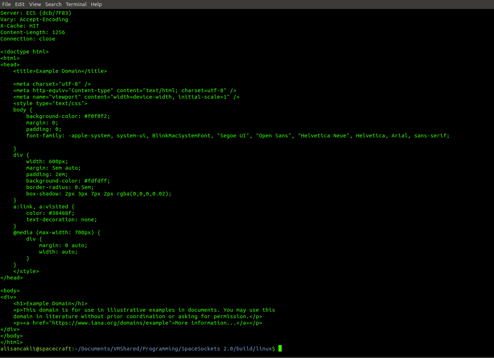
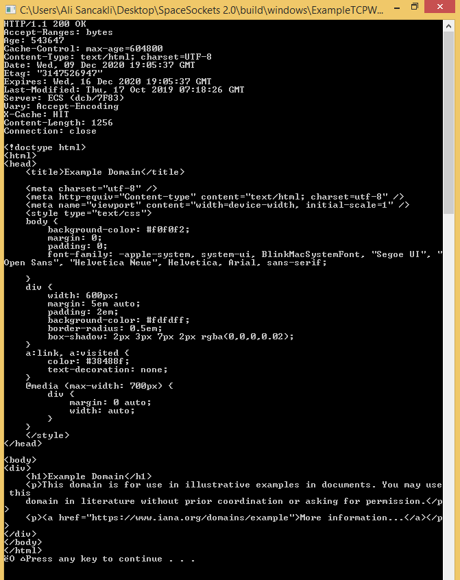

# SpaceSockets 2.0
## Makes network programming much easier and cross-platform for C++ developers!

Hello, developers! Here is the SpaceSockets 2.0 (a.k.a SpaceSockets2)!

### Introducing SpaceSockets 2.0!

We've fixed some connection related bugs and added new functionalities to SpaceSockets 2.0. 

You can find really great examples under "example" folder that are made by using SpaceSockets2. For example, an implementation of "ping" utility or a web server that can send a skeleton webpage to our browser over "localhost".

```sh
 $ ./make.sh // To build under UNIX like or UNIX clone operating systems that runs Bash shell.
```
```sh
 $ fscrift make // To build under Scrift shell.
```


## A big update for SpaceSockets2: Windows port
SpaceSockets2 includes WinSock code that can be used if you are compiling your application on Windows. Without changing any lines of your application code, you can port your SpaceSockets2 applications to Windows. 

Refer to the examples for further information.

### Disclaimer
SpaceSockets2 is licensed under the terms of MIT License. 

### Tutorials for developers
SpaceSockets2's GitHub site will be coming soon! We'll rewrite example applications and see how easy to write programs with SpaceSockets2 is.

### Follow us to keep up-to-date!
[SpaceCraft on Instagram](http://instagram.com/spacecraft_tr)
[SpaceCraft on GitHub](http://github.com/SpaceCraftTR)
